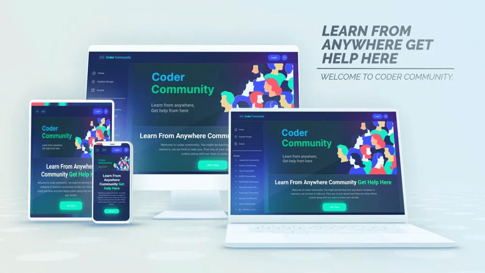
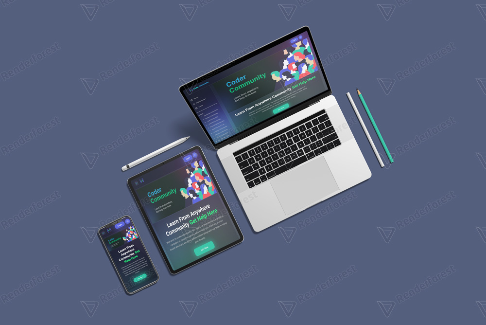

###### Hey there 👋
###### I'm Shyam, a CE student and creative coder and self-proclaimed designer. I make it my mission to translate user-focused designs into pixel-perfect websites.


<video src="./screentshots/coder community_free.mp4" width="100%" loop="true" autoplay="true"></video>






### I made [codercommunity.io](https://codercommunity.io/) landing page design using HTML,CSS and JavaScript

>I Deployed my Project on Netlify and Vercel. so you can check it out 👇
<br> [https://codercomm.netlify.app/](https://codercomm.netlify.app/) `recommended`
<br> [https://codercomm.vercel.app/](https://codercomm.vercel.app/)

### 📌Resources and and its corresponding CDN links
- <b>Fonts(Inter and Manrope)</b>
    ```css
    @import url('https://fonts.googleapis.com/css2?family=Inter:wght@100;200;300;400;500;600;700&family=Roboto:wght@100;300;400;500;700&display=swap');
    ```
 - <b>CSS Variables [NOTE : only for dark mode]</b>
    ```css
    :root
    {
        --primary: #ffffff;
        --secondary: #20f97e;
        --white: #ffffff;
        --dark: #dcdcdd;
        --dark-gray: #dcdcdcea;
        --light-gray: #dcdcdcc5;
        --hover-light-gray: rgba(255, 255, 255, .1);
        --back_circle_1: radial-gradient(218.51% 281.09% at 100% 100%, rgba(253, 63, 51, 0.6) 0%, rgba(76, 0, 200, 0.6) 45.83%, rgba(76, 0, 200, 0.6) 100%);
        --back_circle_2: linear-gradient(rgb(117, 224, 230) 0%, rgb(57, 19, 184) 100%);

        --primary-btn: #4b56e4;
        --secondary-btn: #25cca9;

        --primary-logo-text: #1cfeff;
        --secondary-logo-text: #29b2ff;

        --bg: rgb(16 20 38);
        --hero-bg: rgba(0, 0, 0, 0.103);
        --blur: 150px;

        --padding-x: 5%;
        --border: rgb(255 255 255 / 20%);

        --bg-3: rgba(0, 0, 0, .1);
        --bg-4: rgba(0, 0, 0, .3);
        --bg-5: rgba(34, 43, 69, 0.731);
        --bg-7: rgba(0, 0, 0, 0.272);

        --modal-close-bg: #6f67782b;
        --nav-icon-bg: #6f67782b;

        --modal-btn-bg: rgba(24, 30, 48, 0.491);

        --inter: 'Inter', sans-serif;
        --roboto: 'Roboto', sans-serif;
    }
    ```

- <b>CSS Variables [Note : only for white mode]</b>
    ```css
    :root
    {
        --primary: #4b56e4;
        --secondary: #25cca9;
        --white: #ffffff;
        --dark: #000000;
        --dark-gray: #515050ae;
        --light-gray: #87878f;
        --hover-light-gray: #87878f;
        --back_circle_1: #ffd8d1;
        --back_circle_2: #c5b9ff;

        --primary-btn: #4b56e4;
        --secondary-btn: #25cca9;

        --primary-logo-text: #4b56e4;
        --secondary-logo-text: #25cca9;

        --bg: #e7eaf2;
        --hero-bg: #e7eaf2;
        --blur: 80px;

        --bg-3: rgba(255, 255, 255, .1);
        --bg-4: rgba(255, 255, 255, .2);
        --bg-5: rgba(255, 255, 255, .5);
        --bg-7: rgba(255, 255, 255, .7);

        --modal-close-bg: #ffffff;
        --nav-icon-bg: #ffffff;

        --padding-x: 5%;

        --border: #aeaeb58c;

        --modal-btn-bg: rgba(255, 255, 255, 0.491);

        --inter: 'Inter', sans-serif;
        --roboto: 'Roboto', sans-serif;
    }
    ```


- <b>ION Icon Js CDN</b>
    ```html
    <script type="module" src="https://unpkg.com/ionicons@5.5.2/dist/ionicons/ionicons.esm.js"></script>
    <script nomodule src="https://unpkg.com/ionicons@5.5.2/dist/ionicons/ionicons.js"></script>
    ```

- <b>Swiper slider style</b>
    ```html
    <link rel="stylesheet" href="https://cdn.jsdelivr.net/npm/swiper@8/swiper-bundle.min.css" />
    ```
- <b>Swiper Js CDN</b>
    ```html
    <script src="https://cdn.jsdelivr.net/npm/swiper@8/swiper-bundle.min.js"></script>
    ```

## What I Learned from this Project?

- I learned lot from this project. This types of projects create color sance in my mind.
- learned about how can make pixel perfect web design 
- In this landing page I used [swiper js](https://swiperjs.com/) . By using this JS plugins I learned how can make responsive slider and responsive card slider.
- I learned about backdrop-filter css property.
- I learned lot about DOM manipulation. 


## This Project took around 35:00 Hours ⏲️ to complate.

## Author

- [@shyamtala](https://github.com/shyamtala003)